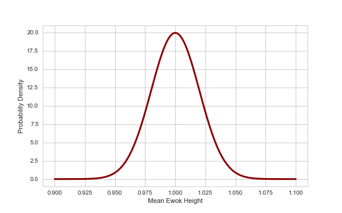

slidenumbers: true
footer:  J. Pounders, DSI-EAST-1

#   Central Limit Theorem and
# Confidence Intervals

### Justin Pounders

---

# Learning Objectives

By the end of the day you should be able to...

- **Define** the normal distribution and the concept of normality.
- **Describe** the uses of the 68-95-99.7 rule and the z-score.
- **Describe** and apply the Central Limit Theorem.

---

# Learning Objectives

By the end of the day you should be able to...

- **Describe** the relationship between the mean, the standard deviation, and the standard error of the mean.
- **Calculate** the standard error of the mean.
- **Define** and **calculate** a confidence interval.

---

# [fit] Normality
# and
# [fit] The Normal Distribution

---

# The Normal Distribution

- aka "bell curve" or Gaussian distribution
- very commonly used in analysis
- often an *assumption* in modeling

---

# Turn and Talk (6 minutes, 3 volunteers)

Assume that IQ is normally distributed with a mean ($$\mu$$) of 100 and a standard deviation ($$\sigma$$) of 15, i.e. $$\text{IQ} \sim N(100, 15)$$.

1. How much of the population is within two standard deviations ($$2\sigma$$) of the mean?
2. If I pick a random person, what is the probability that their IQ will be somewhere between 85 and 115?
3. What is the Z score associated with an IQ of 140? 145?

---

# [fit] Python Time

`go to notebook central-limit-theorem.ipynb`

---

# [fit] Central Limit
# [fit] Theorem

---

# Motivation

I want to know the mean height of male Ewoks on Endor.

- I can't measure them all (the whole *population*)...
- So I will select a *sample* of 100
- Let's say that the mean height of all Ewoks is 1.02 meters

---

# Calculating the mean height

- Collect a sample of 100 heights
- Calculate the mean height, $$\bar{h}$$

```
import numpy as np

heights = [0.95, 1.1, 1.02, 0.88, 0.87, ...]
mean_height = np.mean(heights)
```

---

# Calculating the mean height

**Q**: Is the mean height, $$\bar{h}$$, calculated in this manner, the *sample* or the *population* mean height?

- Raise one arm for *sample*
- Raise two arms for *population*

---

# Calculating the mean height

**Q**: Is the mean height, $$\bar{h}$$, calculated in this manner, the *sample* or the *population* mean height?

- Raise one arm for *sample*
- Raise two arms for *population*

> What would happen if I repeated this "experiment" and collected a different sample?

---

# Multiple samples

| Sample # | Mean Height |
|:--------:|:-----------:|
|     1    |     1.01    |
|     2    |     0.97    |
|     3    |     1.04    |
|     4    |     0.91    |
|    ...   |     ...     |

---

# Multiple samples

| Sample # | Mean Height |
|:--------:|:-----------:|
|     1    |     1.01    |
|     2    |     0.97    |
|     3    |     1.04    |
|     4    |     0.91    |
|    ...   |     ...     |

> We need to make sense of the *randomness* in mean height!

---

# Understanding multiple samples

- An individual Ewok's height is a **random variable**
- The collection of mean heights from multiple samples is a **random variable**

---

> Think of the sample mean as a data point from a known probability distribution.

---

# Understanding multiple samples

- An individual Ewok's height is a **random variable**
  - *Unknown probability distribution*
- The collection of mean heights from multiple samples is a **random variable**
  - *Normal probability distribution!!!* (approximately)

---



---

# Summary of Central Limit Theorem

For samples of independent random variables (fixed sample size), the sample means are random *and normally distributed*.

---

# Main implications and takeaways

- The distribution of the **sample mean** is called the *sampling distribution*
- The sampling distribution is approximately the *normal distribution*
- The standard deviation of the sampling distribution is called the *standard error*

$$\sigma_{\bar{h}} = \frac{\sigma}{\sqrt{n}}$$

---

> The *standard error* represents the uncertainty of the sample mean relative to the true population mean.

---


---

# CLT: Properties

- If $$X \sim N(\mu,\sigma)$$, then $$\bar{X}$$ is exactly $$N(\mu,\frac{\sigma}{\sqrt{n}})$$

i,e,

- If $$X$$ is a *normal* random variable, the mean of a sample of $$X$$ is *exactly normally distributed*

---

# CLT: Properties

- If $$X$$ is not normally distributed, then $$\bar{X}$$ is approximately $$N(\mu,\sigma/\sqrt{n})$$ if the sample size $$n$$ is at least 30.

i.e.,

- If $$X$$ is *not* a normal random variable, then the mean of a sample of $$X$$ is *approximately normally distributed* as long as the sample is size is more than 30.

---

# CLT: Practical Issue

$$\bar{X} \sim N(\mu,\sigma/\sqrt{n})$$, but $$\mu$$ and $$\sigma$$ typically have to replaced with sample estimates.

$$N(\mu,\sigma) \approx N(\bar{X}, s/\sqrt{n})$$

---

# [fit] Python Time

`go to notebook central-limit-theorem.ipynb`

---

# Reflect

**Q**: What is the most confusing part about central limit theorem or standard error?

> Respond on slack.

---

# Confidence Interval

What we got with CLT:
- sample mean is normally distributed...
- with mean $$\mu$$ and...
- standard deviation $$\sigma/n$$ (aka standard error)

What we want next:
- give me a range of values that has a...
- 95% chance of including the true (population mean)

---

> A *confidence interval* describes a **range of possible values for the true mean**  based on a sample mean.

---

# Confidence Interval

$$\text{CI} = \bar{x} \pm z \cdot \frac{s}{\sqrt{n}}$$

where
- $$\bar{x}$$ is the sample mean
- $$z$$ is a set z score
- $$s$$ is the sample standard deviation
- $$n$$ is the number of observations in sample

*How to pick $$z$$?*

---

# Confidence Interval

Pick $$z$$ to establish level of *confidence*:
- 90% confidence... $$z=1.645$$
- 95% confidence... $$z=1.96$$
- 99% confidence... $$z=2.575$$

---

# Confidence Interval

Pick $$z$$ to establish level of *confidence*:
- 90% confidence... $$z=1.645$$
- 95% confidence... $$z=1.96$$
- 99% confidence... $$z=2.575$$

**What do we mean by "confidence"?**

---

# Confidence Interval

Suppose the 95% confidence interval for my average morning commute is 35 to 55 minutes.

**Correct Interpretation**
> If I generated lots of samples from my commute history, and calculated a confidence interval for each, those intervals would contain the "true mean" of my commute 95% of the time.

---

# Confidence Interval

Suppose the 95% confidence interval for my average morning commute is 35 to 55 minutes.

**Not Quite Correct Interpretation**
> There is a 95% probability that my commute time each day will be between 35 and 55 minutes.

---

# [fit] Python Time

`go to notebook confidence-intervals.ipynb`
